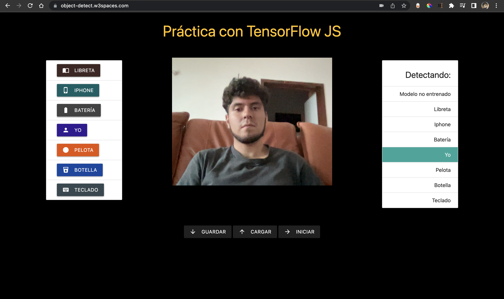
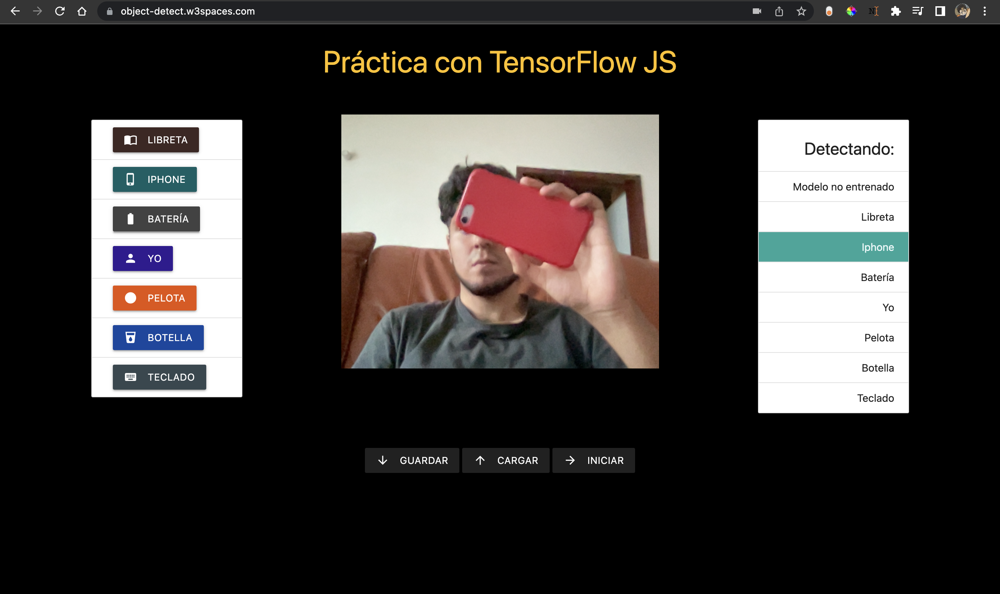

# 🇬🇧 Object Detection Using TensorFlow Js

This practice use two TensorFlow models: the MobileNet model (that was trained with images) and the KNN model.

This practice use TensorFlow js for detect objects that you show and you teach the model, so you can show objects to your webcam and press the buttons for teach the model that objects, objects like your face, phone, ball and a batery(whatever you want); this objects includes the demo practice, that looks like this The next practice add two objects more, and new functionalities like save the training dataset (these are the objects you show the model previously) and load the dataset that you save before.

# 🇲🇽 Detección de Objetos con TensorFlow Js

Esta práctica usa dos modelos de TensorFlow: un KNN y uno ya preentrenado que se llama Mobilenet que fue entrenado con imágenes.

Esta práctica usa TensorFlow para detectar objetos mediante la webcam. El objetivo de la práctica es demostrar como es que un modelo de Machine Learning puede ser entrenado en tiempo real por tí mismo. Solo basta mostrar los objetos en cámara y mediante los botones, informarle al modelo que objeto se le está mostrando. De esa manera con unas pocas pruebas, el modelo será capaz de distinguir entre todos nuestros objetos disponibles.

# Links
* **Demo**: [object-detect.w3spaces.com/demo](https://object-detect.w3spaces.com/demo.html)
* **Complete**: [object-detect.w3spaces.com](https://object-detect.w3spaces.com/)
