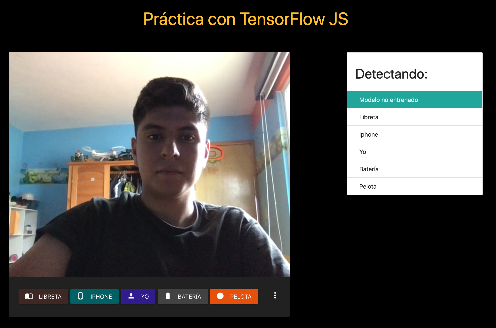
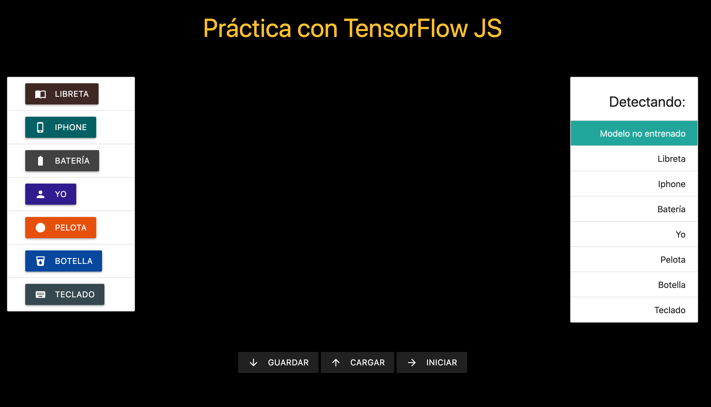

# Object Detection Using TensorFlow js

This practice use TensorFlow js for detect objects that you show and you teach to the model,you can show objects to your webcam and press the buttons for teach the model that objects, objects like your face, phone, ball and a batery; this objects includes the demo practice, that looks like:

the next practice add two objects more, and new functionalities like save the training dataset (these are the objects you show the model previously) and load the dataset that you save before, it looks like:

This practice use two TensorFlow models: the MobileNet model and the KNN model.